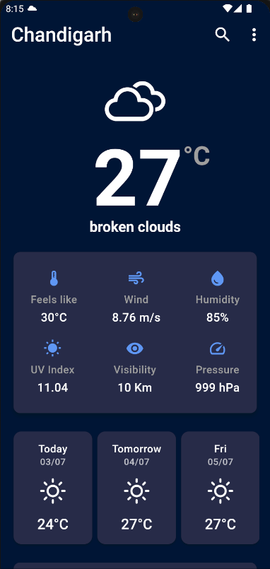
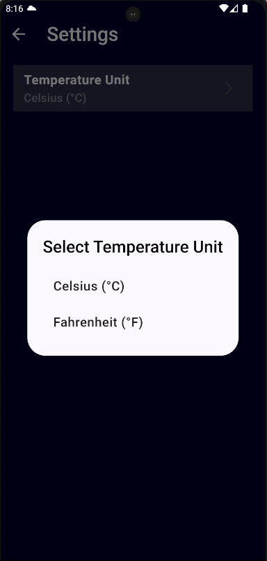

# Weather App

A simple and elegant weather application built using Flutter. This app provides real-time weather updates, 5-day forecasts, air pollution data, and sunrise/sunset information based on the user's location or a selected city.

## Features

- **Real-time Weather Data**: Get the latest weather information including temperature, humidity, wind speed, and more.
- **5-Day Forecast**: View weather forecasts for the next five days.
- **Air Pollution Data**: Check the air quality index and pollution levels.
- **Sunrise and Sunset Times**: Know the exact times for sunrise and sunset.
- **City Search**: Search for weather information by city name.
- **Geolocation**: Automatically fetch weather data based on your location.

<div style="display: flex; justify-content: space-around;">
  
  
  
</div>

## Installation

Follow these steps to install and run the weather app:

### Prerequisites

- Flutter SDK: [Install Flutter](https://flutter.dev/docs/get-started/install)
- A code editor (like VSCode or Android Studio)

### Steps

1. **Clone the repository**

   ```bash
   git clone https://github.com/anubhav-18/Weather_App
   cd weather-app

2. **Install dependencies**

   ```bash
   flutter pub get

3. **Clone the repository**
   
   - Sign up for an API key from a weather data provider (e.g., OpenWeatherMap).
   - Add the API key to your project by creating a apikey.dart file in the lib directory and define your key.
   
4. **Clone the repository**
      
   ```bash
   flutter run

## Usage

- **Home Screen**: Displays the current weather information for the selected city or current location.
- **Forecast**: Swipe horizontally to view the 5-day weather forecast.
- **Air Pollution**: View air quality data including the AQI value.
- **Sunrise/Sunset**: Shows the sunrise and sunset times for the selected city.
- **Search**: Tap the search icon in the app bar to search for weather information by city name.
- **Settings**: Access additional settings by tapping the more options icon in the app bar.

## Additional Notes

- **Geolocation**: Ensure that the app has permission to access your location. The app uses the `geolocator` package to fetch the current location.
- **Data Fetching**: Weather data is fetched from a weather API. Ensure that you have a valid API key and internet connection.
- **Error Handling**: The app handles errors such as network issues and invalid API responses gracefully by displaying appropriate messages to the user.

## Contributions

Contributions are welcome! If you find any issues or want to add new features, feel free to open a pull request or file an issue.

## License

This project is licensed under the MIT License. See the [LICENSE](LICENSE) file for details.

## Contact

For any queries or support, please contact [anubhavbindal16@gmail.com].


